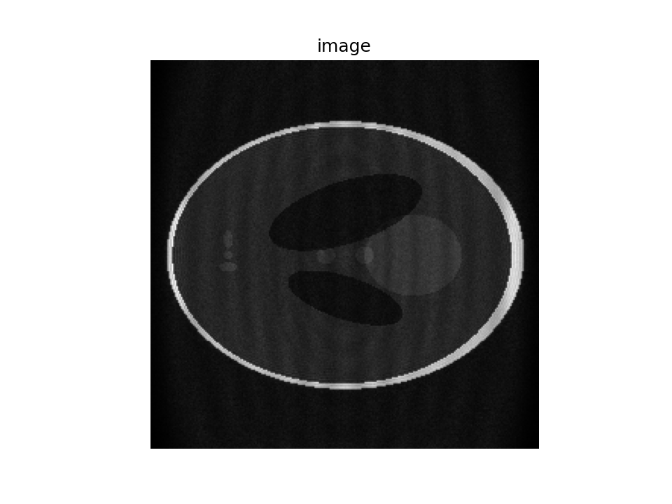

# Gadgetron Pipelines of Medical Images Reconstruction

> GadPipe: A Python Library for Reconstructing MRI Images using Gadgetron Framework.

## Introduction

GadPipe is an application-level library, based on Gadgetron pipelines, to do reconstruction on MRI images.  

## Prerequisite
1. clone gadgetron to your workspace
```bash
$ git clone https://github.com/gadgetron/gadgetron.git
$ cd gadgetron
```
2. create a conda environment using environment.yml
```bash
# using mamba to create the gadgetron environment is faster

# use base environment to install mamba
$ conda activate
$ conda install mamba -c conda-forge

# use mamba to create environment
$ mamba env create -f environment.yml
```
3. start gadgetron environment, then build gadgetron
```bash
$ conda activate gadegtron

$ mkdir -p build
$ cd build
$ cmake -GNinja -DCMAKE_BUILD_TYPE=Release -DUSE_MKL=ON -DCMAKE_INSTALL_PREFIX=${CONDA_PREFIX} ../
$ ninja
$ ninja install
```
4. test gadgetron
```bash
# check gadgetron info
$ gadgetron --info

# start a gadgetron server
$ gadgetron
```

Generate an ismrmrd raw data and do reconstruction using gadgetron
```bash
# generate a dataset in the current working directory (./testdata.h5) with 8 coils and 10 repetitions.
$ ismrmrd_generate_cartesian_shepp_logan -r 10

$ gadgetron_ismrmrd_client -f testdata.h5
Gadgetron ISMRMRD client
  -- host            :      localhost
  -- port            :      9002
  -- hdf5 file  in   :      testdata.h5
  -- hdf5 group in   :      /dataset
  -- conf            :      default.xml
  -- loop            :      1
  -- hdf5 file out   :      out.h5
  -- hdf5 group out  :      2022-03-08 00:35:04
```
Now you could see a out.h5 file in the current directory.

## Usage

### Research and Development  

1. clone this repository to your workspace
```bash
$ git clone https://github.com/medlab/gadpipe
$ cd gadpipe/gadpipe
```
2. link the python script and config directory to gadgetron-required python and config directory
```bash
$ ln -s $PWD/recon/*.py $CONDA_PREFIX/share/gadgetron/python/
$ ln -s $PWD/recon_config $CONDA_PREFIX/share/gadgetron/config/
```
3. if you only want to use our library, you could install it using pip
```bash
$ pip install .
```

### Deployment  

Clone the repository to your workspace, then create a Docker image using scripts provided.
```bash
$ git clone https://github.com/medlab/gadpipe
$ cd gadegtron-4-fun/shell
$ bash create_gad_image.sh
$ bash start_gad_container.sh
```


## Example
```bash
$ conda activate gadegtron  # skip this step in Docker, only in R&D scenario

# generate a raw data with k space trajectory
$ ismrmrd_generate_cartesian_shepp_logan -k

# start a gadgetron server
$ gadgetron  
```   
  
In another shell  
```bash
$ gadgetron_ismrmrd_client -f testdata.h5 -c recon_config/recon_radial.xml
```  

Expected image:
  

# Reference:
1. https://gadgetron2020.sciencesconf.org/
2. https://gadgetron.readthedocs.io/
3. https://github.com/gadgetron/GadgetronOnlineClass
4. https://github.com/chidiugonna/learn-gadgetron
5. https://github.com/ismrmrd/ismrmrdviewer
